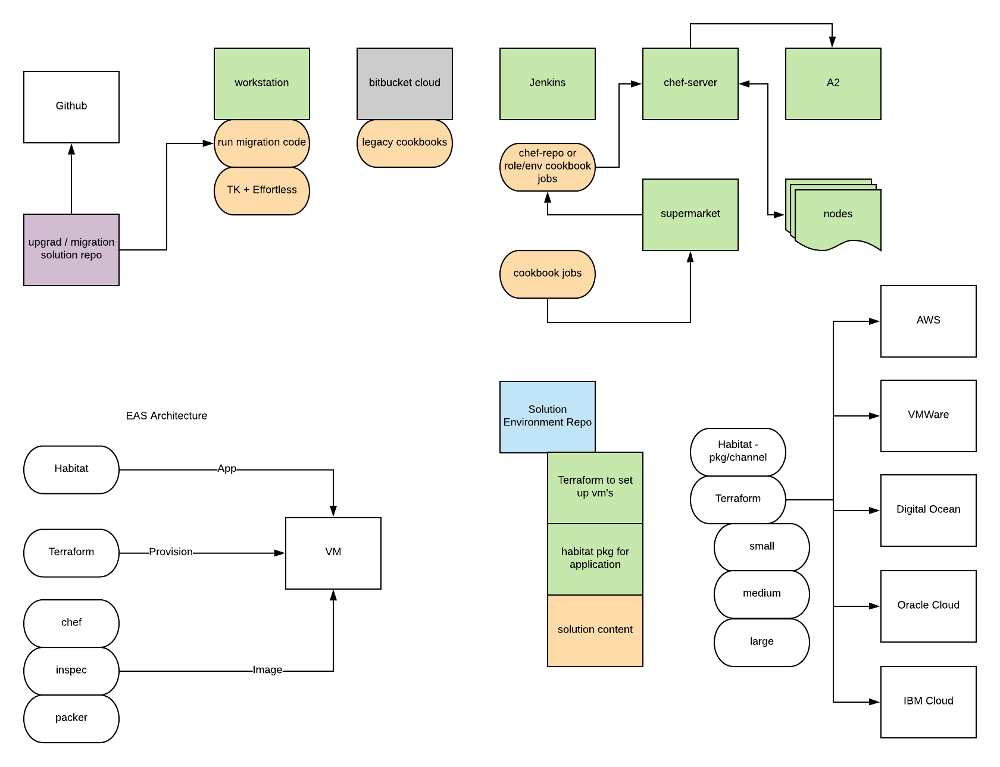

# Chef Upgrade and Migration environment
## Enterprise Automation Stack Environment

## EAS based code to build an environment to demonstrate a Chef15 upgrade and Effortless Pattern Migration

### Supported Stories
* Upgrade and Migration to Chef15/Effortless

### Long Term Goals
* Long running customer-like Chef environment
* Long running customer-like Linux systems
* Long running customer-like Windows systems
* Deployable customer-like Linux / Windows systems
    * Supporting multiple deployment targets

### Target Use Cases
* Internal solution development against customer-like systems
* User acceptance for EAS patterns, features and issues
* A demo environment for solutions internal stakeholders /external customers 

### Assumptions
* this environment is like a long running customer environment
  * tools already installed
  * pipelines already setup
  * chef software already setup
  * nodes checking in
  * everything managed
  * real certs / self signed too (to replicate reality)
* contract is from customer to chef
  * story is of top value
* environment is shared across all users
  * intent is to create customer (enterprise) empathy and expose flaws in our tools in customer-like environments
* dev work in these environments may break the environment
  * follow our own support protocols to restore service
  * follow bug flow to remediate issues
* can be used to validate break/fix
* values solution approach approach over practitioner approach 

### Requirements
* low overhead build that provides example to talk features or direction
* completely shows our end to end products and them running
* ability to walk full customer story
* avail 24/7 for anyone at chef
* serves as the UAT environment for Chef the Company, Chef EAS
* Use the best practice to build and deploy Chef products
* Only do EAS and newest version of Chef Software
* leverage as much previous work as possible

### Blocking work

* cannot do the upgrade/migration prototype until UAT env is up and functioning, and reproducible

### Architecture UAT (first pass)

#### Linux (Enterprise Workflow)

* chef-server
* automate
* bldr api
* supermarket
* chef workstation

* source control tool
  * ADO git
  * Bitbucket
* pipeline tool
  * ADO pipeline
  * Jenkins
* artifact store
  * Azure storage
  * Artifactory

* long running linux node
* long running windows node

* deployable N linux nodes
* deployable N windows nodes
